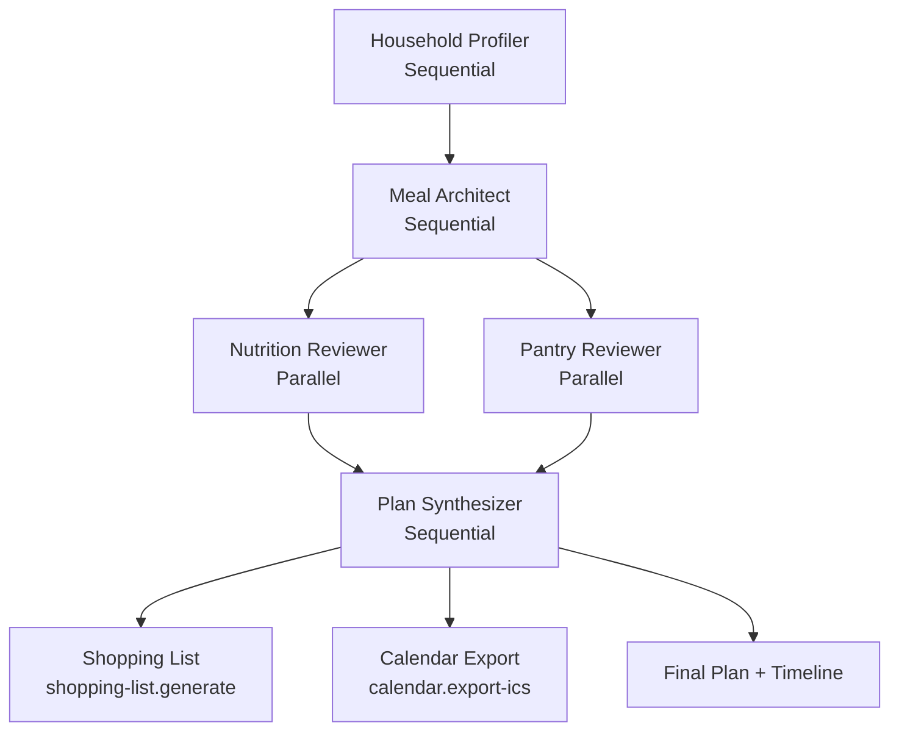

# EcoFood

EcoFood is an AI-assisted meal planner that helps households eat healthier and more diversified meals.  
It plans meals on a calendar while remembering each household’s preferences, tastes, and allergens.

## Overview

The app focuses on:
- Calendar-based meal planning (daily / weekly view)
- Household memory (who lives there, typical meals, pantry staples)
- Preference-aware suggestions (tastes, cuisines, dislikes)
- Allergen- and restriction-safe menus

The goal is to make it easy to eat better, reduce repetition, and gently nudge people toward more varied, balanced food choices.

See `FEATURES.md` for the capstone / agent-system feature set.

## Tech Stack

- Web app (UI): Next.js + React + TypeScript (npm) in `apps/web`
- Styling: Tailwind CSS with a dark, futuristic, responsive design
- Backend: Python (FastAPI) multi-agent / AI service in `backend` managed via `uv`

## Agent Workflow

EcoFood orchestrates specialized agents using an Agent-to-Agent (A2A) workflow:

- Sequential phase:
  1. **Household profiler** normalizes members/allergens/preferences.
  2. **Meal architect** drafts a weekly plan via MCP tools (`recipes.search`, `plans.save-and-tag`).
- Parallel phase:
  - **Nutrition reviewer** analyzes the draft via `nutrition.analyze`.
  - **Pantry reviewer** suggests leftover usage via `pantry.suggest-usage`.
- Final sequential phase:
  - **Plan synthesizer** merges reviews, generates a shopping list (`shopping-list.generate`), and exports a calendar (`calendar.export-ics`).

The workflow is exposed through the `/plans/generate` endpoint.



## Concepts & Roadmap

- Nutritional balance coach: weekly nutrition scores and gentle suggestions for healthier swaps.
- Exploration mode: regularly propose “new-to-you” recipes to expand cuisines, ingredients, and techniques.
- Leftover- and pantry-aware planning: suggest meals that use what you already have and reduce food waste.
- Budget & season-aware planning: keep to a budget while favoring seasonal, local ingredients when possible.

## Setup

1. Create a Gemini API key (from Google AI Studio or equivalent).
2. Expose it to the app, for example via environment variable:
   - `GEMINI_API_KEY=your_gemini_key_here`
3. (Optional) Create Langfuse keys if you want observability / analytics:
   - `LANGFUSE_PUBLIC_KEY=...`
   - `LANGFUSE_SECRET_KEY=...`
   - `LANGFUSE_BASE_URL=...` (points to the Langfuse UI; defaults to `http://localhost:3001` when self-hosted)
   - When running the bundled Langfuse stack add secrets for `LANGFUSE_NEXTAUTH_SECRET`, `LANGFUSE_ENCRYPTION_KEY`, and `LANGFUSE_SALT` in your `.env` file.
4. (Optional) To self-host Langfuse locally, run `docker compose up` and visit `http://localhost:3100`. We currently run `langfuse/langfuse:2` plus a minimal Postgres service (`langfuse-db`). The compose file provides safe defaults for `NEXTAUTH_SECRET`, `SALT`, and `ENCRYPTION_KEY`, so you can get started without editing `.env`; when we need the full ingestion pipeline (ClickHouse, worker, etc.) we can switch back to the newer stack and override the `LANGFUSE_*` secrets.

How you load these (e.g. `.env` file, secrets manager, or deployment config) depends on the stack you use; just ensure the app can read the variables above.

## Project Structure

- `apps/web` – Next.js frontend (npm, TypeScript, Tailwind)
- `backend` – Python backend (FastAPI, uv-managed)
- `FEATURES.md` – Capstone feature checklist
- `ROADMAP.md` – High-level phases and milestones
- `LICENSE` – Project license

## Running the Project

### Web app (npm)

From `apps/web`:

```bash
npm install
npm run dev
```

Then open `http://localhost:3000`.

### Backend (uv)

From `backend`:

```bash
uv sync
uv run ecofood-backend
```

The backend will be available on `http://localhost:8000` (health check at `/health`).

## Household Management & Assistant

- `GET /households` – list all households with their members.
- `POST /households` – create a household (the UI auto-creates “My household” for you).
- `POST /households/{household_id}/members` – add a member (name, role, allergens, preferences).
- `DELETE /households/{household_id}/members/{member_id}` – remove a member.
- `POST /households/{household_id}/assistant` – dialog agent that walks through questions and saves the result to SQL.

The Household tab now consumes these endpoints: it loads empty by default, supports add/remove buttons, and the “Use assistant” button opens the dialog agent to capture allergens and taste preferences.

### Generating a Plan via API

```bash
curl -X POST http://localhost:8000/plans/generate \
  -H "Content-Type: application/json" \
  -d '{
    "session_id": "demo-session",
    "members": [
      {"name": "Alex", "role": "Adult", "allergens": ["peanuts"], "likes": ["mediterranean"]},
      {"name": "Mia", "role": "Child", "likes": ["pasta", "bento"]}
    ],
    "pantry_items": [
      {"name": "spinach", "quantity": 2, "unit": "cups", "days_until_expiry": 2},
      {"name": "salmon", "quantity": 1, "unit": "fillet", "days_until_expiry": 1}
    ],
    "notes": "Weeknight friendly meals"
  }'
```

You will receive the agent timeline, plan, reviews, shopping list, and ICS payload in the response.

## Status

This is a capstone project under active development. The architecture is agent-intensive and designed to explore multi-agent patterns, tools, and long-term memory.
