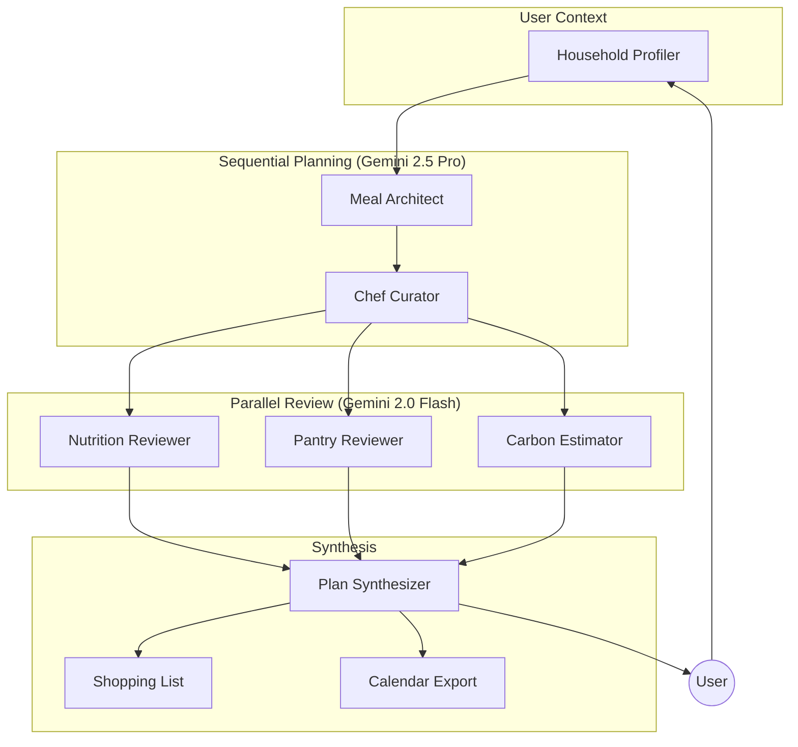

# EcoFood: AI Concierge for Sustainable Eating

**EcoFood** is an agentic AI platform that acts as your personal **Concierge Agent** for sustainable eating. It serves as your executive chef and sustainability consultant, helping households eat better while reducing their carbon footprint.

Unlike static recipe apps, EcoFood orchestrates a team of specialized AI agents—from a "Meal Architect" to a "Carbon Estimator"—to generate dynamic, personalized meal plans that respect your dietary needs, use up your leftovers, and optimize for the lowest environmental impact.

---

## 🏆 Kaggle Submission

This project is submitted for the **Google AI Agents Intensive Capstone**.

### [Category 1: The Pitch](./kaggle_submission/Category1_The_Pitch.md)
> **"The Why"**: Read about the problem we're solving, our dual sustainability goals (Food CO2 + AI Compute), and the developer's journey.

### [Category 2: The Implementation](./kaggle_submission/Category2_The_Implementation.md)
> **"The How"**: Deep dive into the Agent-to-Agent (A2A) architecture, Model Context Protocol (MCP) integration, and our custom Context Compaction memory system.

### [Full Feature Documentation](./FEATURES.md)
> **"The What"**: A detailed checklist of the full agentic features demonstrating the capstone project capabilities, from the Household Profiler to the Real-time Carbon Scoring.

---

## 🏗️ Architecture

EcoFood is built on a modern, scalable stack designed for resilience and observability.

-   **Frontend**: Next.js (React) with Server-Sent Events (SSE) for real-time agent feedback.
-   **Backend**: Python FastAPI service managing the agent workflow.
-   **AI Engine**: Google Gemini (Flash 2.0 & Pro 2.5) via a custom resilient client.
-   **Orchestration**: A custom Directed Acyclic Graph (DAG) engine manages the lifecycle of meal planning jobs.

### Agent Workflow
The system uses an **Agent-to-Agent (A2A)** pattern where specialized agents collaborate to build the final plan.


```mermaid
graph TD
  subgraph User Context
    HP[Household Profiler]
  end

  subgraph "Sequential Planning (Gemini 2.5 Pro)"
    HP --> MA[Meal Architect]
    MA --> CC[Chef Curator]
  end

  subgraph "Parallel Review (Gemini 2.0 Flash)"
    CC --> NR[Nutrition Reviewer]
    CC --> PR[Pantry Reviewer]
    CC --> CE[Carbon Estimator]
  end

  subgraph Synthesis
    NR --> PS[Plan Synthesizer]
    PR --> PS
    CE --> PS
    PS --> SL[Shopping List]
    PS --> Cal[Calendar Export]
  end

  User((User)) --> HP
  PS --> User
```

---

## 🚀 Getting Started

### Prerequisites
1.  **Gemini API Key**: Get one from [Google AI Studio](https://aistudio.google.com/).
2.  **Docker**: Ensure Docker Desktop is installed and running.

### Option 1: Docker Desktop (Recommended)
This is the primary development environment.

1.  **Clone the repository**:
    ```bash
    git clone <repo-url>
    cd EcoFood
    ```

2.  **Configure Environment**:
    Create a `.env` file in the root directory:
    ```env
    # Required: Google Gemini API Key
    GEMINI_API_KEY=your_key_here

    # Optional: Configure Models
    # Used for complex reasoning (Meal Architect) - Default: gemini-2.5-pro
    GEMINI_COMPLEX_TASK_MODEL=gemini-2.5-pro
    # Used for fast tasks (Tools, Summarizer) - Default: gemini-2.0-flash
    GEMINI_FAST_TASK_MODEL=gemini-2.0-flash

    # Optional: Langfuse Observability
    # 1. Create a project at https://langfuse.com (or self-host)
    # 2. Get your public/secret keys
    # 3. Add them here and restart docker compose
    LANGFUSE_PUBLIC_KEY=pk-lf-...
    LANGFUSE_SECRET_KEY=sk-lf-...
    LANGFUSE_HOST_URL=https://cloud.langfuse.com # or http://localhost:3000 if self-hosted
    ```

3.  **Run the App**:
    ```bash
    docker compose up --build
    ```

4.  **Access the App**:
    Open [http://localhost:3000](http://localhost:3000) in your browser.

### Option 2: Google Kubernetes Engine (GKE) (Beta)
For production-grade scalability, the project includes a full Kubernetes deployment configuration.

> **Note**: This requires a Google Cloud project with GKE enabled.

1.  **Navigate to Deployment**:
    ```bash
    cd GKE_deployment
    ```

2.  **Follow Instructions**:
    See the [GKE README](./GKE_deployment/README.md) for detailed steps on setting up the cluster, secrets, and deploying the manifests.

---

## 🧩 Capstone Implementation Checklist

For a detailed breakdown of every feature, see the [Full Feature Documentation](./FEATURES.md).

- [x] **Multi-agent system**, including any combination of:
    - [x] Agent powered by an LLM
    - [x] Parallel agents
    - [x] Sequential agents
    - [ ] Loop agents
- [x] **Tools**, including:
    - [x] MCP
    - [x] custom tools
    - [ ] built-in tools, such as Google Search or Code Execution
    - [ ] OpenAPI tools
    - [ ] Long-running operations (pause/resume agents)
- [x] **Sessions & Memory**
    - [x] Sessions & state management (e.g. InMemorySessionService)
    - [x] Long term memory (e.g. Memory Bank)
- [x] **Context engineering** (e.g. context compaction)
- [x] **Observability**: Logging, Tracing, Metrics
- [ ] **Agent evaluation**
- [x] **A2A Protocol**
- [x] **Agent deployment**

---

*Built with ❤️ for the planet.*

---

## 🔮 Future Improvements

We have an exciting roadmap to further enhance EcoFood's capabilities:

-   **Expanded MCP Integration**: Adding more tools to the registry, such as direct integration with smart fridge APIs and grocery delivery services.
-   **Local Online Store Connection**: Enabling the agent to not just plan meals but also populate carts on local grocery store platforms (e.g., Instacart, Amazon Fresh) for one-click ordering.
-   **A2P (Agent-to-Person) Protocol**: Implementing proactive communication where the agent can reach out via SMS or email to suggest meal prep steps or remind you of expiring ingredients.
-   **Nutritional Balance Coach**: A long-term health tracking agent that monitors your weekly intake and suggests adjustments for a balanced diet.
-   **Community Recipe Exchange**: Allowing households to share their favorite AI-optimized recipes with the wider EcoFood community.
...
